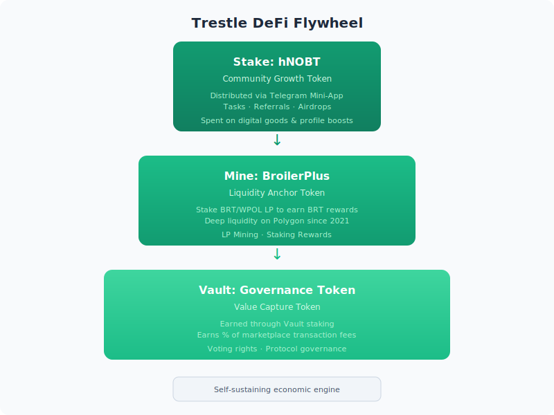
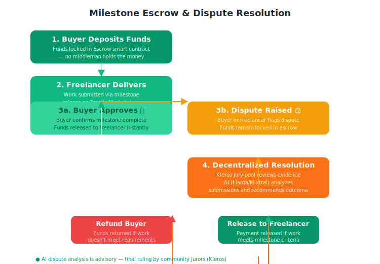
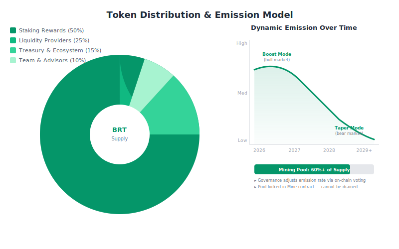
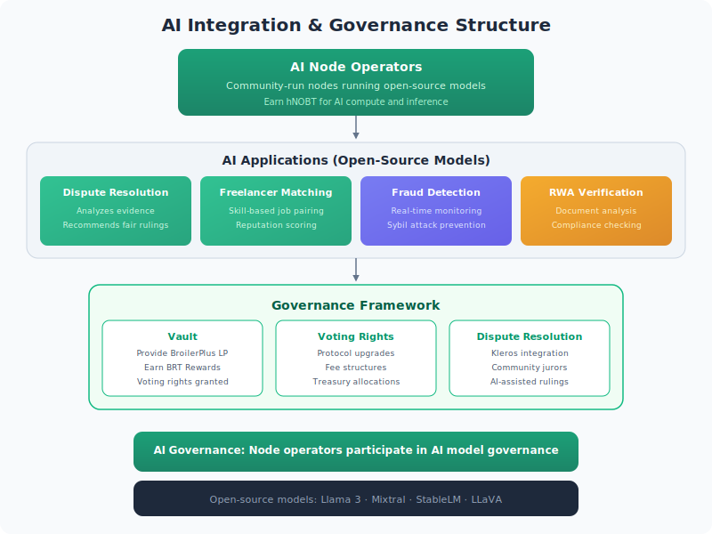
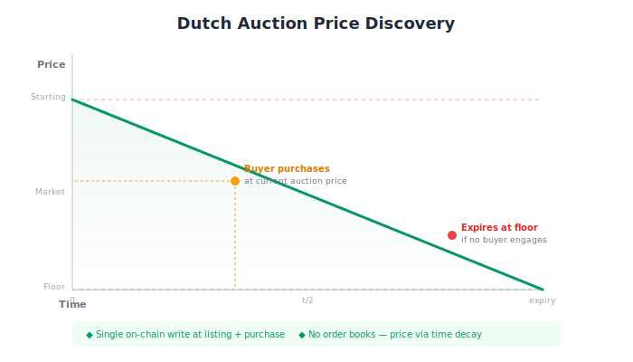

# Trestle DeFi: A Decentralized Marketplace for Digital Assets, Freelancer Services, and Real-World Assets (RWA)

**Version:** 1.0 | **Date:** June 2026 |
**Status:** Live on Polygon Mainnet & Amoy Testnet
**Mainnet** Core Staking & Liquidity Mining (hNOBT, BroilerPlus, Distributor) ✅ Live.
**Testnet** (Amoy): Marketplace Escrow, Dutch Auction, and RWA Infrastructure ✅ Live.
**Mainnet** Marketplace: 🚧 In Development / Audit Phase.

**Disclaimer:** Not affiliated with Trestle Protocol (Celestia Bridge).
---

## Table of Contents
1. [Executive Summary](#executive-summary)
2. [Vision and Mission](#vision-and-mission)
3. [The Trestle Ecosystem](#the-trestle-ecosystem)
4. [Tokenomics](#tokenomics)
5. [Governance and Vault Mechanics](#governance-and-vault-mechanics)
6. [Technical Architecture](#technical-architecture)
7. [Roadmap](#roadmap)
8. [Current Projects and Progress](#current-projects-and-progress)
9. [Why Trestle?](#why-trestle)
10. [Social Media and Resources](#social-media-and-resources)

---

## Executive Summary

**Trestle Platform** is a **decentralized, community-driven marketplace** that bridges the gap between **decentralized finance (DeFi), freelancer services, and real-world assets (RWA)**. Built on a **battle-tested liquidity foundation** (established in 2021), Trestle creates a **self-sustaining economic engine** where users earn through contribution, liquidity, and governance.

### The Problem

Existing marketplaces are **siloed, complex, and exclusionary**:
- High fees and lack of professional escrow for freelancers.
- High barriers to entry for **Real-World Assets (RWA)**, limiting access to institutional-grade opportunities.
- Most "Web3" projects lack **long-term economic depth**, failing to survive market cycles.

### The Solution: The Trestle DeFi Flywheel

Trestle DeFi leverages a **three-token system** to drive growth, secure liquidity, and capture value:



1. **hNOBT (Community Growth Token)**
   - The **gateway token**, distributed via the **Telegram Mini-App** for tasks, referrals, and early-stage engagement.
   - Designed to **absorb sell-pressure** by enabling utility (e.g., spending on digital goods, boosting freelancer profiles).

2. **BroilerPlus (Liquidity Anchor Token)**
   - The **core asset** (active on Polygon since 2021), providing **deep liquidity** for the marketplace.
   - Staked as BRT/WPOL LP through **Mine** to earn additional BroilerPlus rewards and Governance Points.

3. **Governance Token (Value Capture Token)**
   - The **premium asset** for stakeholders, earning a **percentage of all marketplace transaction fees**.
   - Granting **voting rights** over the Platform's future, ensuring **community-driven governance**.

### Proof of Commitment

To ensure governance remains in the hands of **long-term supporters**, the **Governance Token** is **not sold or easily farmed**. It is earned exclusively through **Vault staking**, requiring a commitment to the ecosystem's liquidity. This protects the Platform from **short-term speculators** and aligns governors with the **long-term health** of the marketplace.

### Key Innovations for 2026

- **Virtual Vault Off-Chain Accumulation**: Users earn and stake **hNOBT points entirely off-chain** via the reward vault worker and Telegram Mini-App. Settlement produces an **EIP-712 voucher** that is submitted on-chain — no gas fees. The Virtual Vault is separate from the main website dApp Vault (which handles Governance Token staking).
- **Telegram-Native Interface**: A **Mini-App** acts as the command center for staking, task management, and marketplace browsing.
- **Secure Milestone Escrow**: Smart contract-based payments for freelancers ensure funds are **only released upon verified work completion**, protected by a **decentralized dispute resolution system** (e.g., Kleros).
- **Fractional RWA**: Providing the infrastructure to **tokenize and trade fractional shares** of real-world assets, bringing **institutional-grade opportunities** to everyday users.
- **Decentralized AI Integration**: **Open-source AI models** handle dispute resolution, freelancer matching, fraud detection, and RWA verification, operated by community AI nodes earning hNOBT rewards.
- **Queue-Based AI Processing**: AI requests are offloaded to a **Cloudflare Queue** with async job lifecycle tracked in KV — no endpoint timeouts, instant user feedback, and retry tolerance.
- **Auto-Moderation Shield**: Telegram and Discord webhooks process all messages through a **spam pattern matcher + HuggingFace toxicity classifier** with automatic 24-hour mute and admin alerts.

### Development Philosophy

**Security over Speed**. Trestle Platform follows a **milestone-driven roadmap**, utilizing a **dedicated Bug Bounty fund** to collaborate with global developers. By launching staking on **Mainnet** while perfecting the Marketplace on **Testnet**, we ensure a **robust, audited, and community-backed ecosystem**.

---

## Vision and Mission

### Vision

To create a **self-sustaining economic bridge** between the **gig economy and global financial stability**, where **digital labor meets real-world asset ownership**.

### Mission

Trestle Platform empowers **freelancers, investors, and communities** to:
- **Earn** through digital work and contributions.
- **Stake** to secure liquidity and governance rights.
- **Own** fractional shares of **real-world assets (RWA)**.
- **Govern** the Platform's future through **community-driven decision-making**.

### Core Values

1. **Integrity by Architecture**
   - Trust is a **feature, not a feeling**. Every milestone and asset is **verifiable on-chain**.

2. **Velocity of Labor**
   - Work shouldn't wait for banking hours. **Zero-friction onboarding** via Telegram and **off-chain Virtual Vault accumulation** enable instant earning and staking without gas fees.

3. **Radical Inclusivity**
   - Fractional ownership should be a **right, not a privilege**. A freelancer in any country can own a piece of **real estate, treasury bonds, or other RWAs**.

4. **Anchored Stability**
   - While markets fluctuate, Trestle remains **grounded**. The **three-token system** creates **deep liquidity** and **long-term value** for stakeholders.

5. **Community Stewardship**
   - The users who **build the platform** are the ones who **own and steer it**. All Platform fees and marketplace directions are **voted on by Governors**.

6. **Decentralized AI Empowerment**
   - **Open-source AI models** operated by community node operators enhance efficiency while maintaining decentralization. AI decisions are verifiable, auditable, and governed by token holders.

---

## The Trestle Ecosystem

### The Three-Token System

| Section | Token | Purpose | Utility |
|---------|-------|---------|---------|
| **Stake** | hNOBT | Community Growth | Distributed via Telegram Mini-App for tasks, referrals, and early engagement. Can be spent on **digital goods** or used to "boost" freelancer profiles. |
| **Mine** | BroilerPlus | Liquidity Anchor | Stake BRT/WPOL LP to earn BroilerPlus rewards and Governance Points. Active on Polygon since 2021. |
| **Vault** | Governance Token | Value Capture | Earns a percentage of **marketplace transaction fees** and grants voting rights. Earned exclusively through Vault staking. |

### The Marketplace: Empowering Freelancers and Digital Creators

Trestle Platform is a **decentralized, multi-sided marketplace** designed to empower **freelancers, digital creators, and buyers** with **secure, instant, and low-fee transactions**. The marketplace connects:

1. **Freelancers** (digital labor and services).
2. **Buyers** (digital goods, services, and assets).
3. **Liquidity Providers** (stakers and investors).



#### Key Features for Freelancers and Digital Goods

- **Secure Milestone Escrow**: Smart contracts hold funds until work is verified, with **decentralized dispute resolution** (e.g., Kleros).
- **Instant Payments**: Freelancers receive payments **immediately upon milestone completion**, with no banking delays.
- **Profile Boosting**: Spend **hNOBT** to boost visibility and attract more clients.
- **Digital Goods Marketplace**: Buy and sell **NFTs, templates, software, and other digital assets** with zero middlemen.
- **Telegram Mini-App**: A **zero-friction interface** for browsing gigs, managing tasks, and receiving payments.
- **Virtual Vault** (reward hub + TMA): Users accumulate hNOBT points off-chain and settle via **EIP-712 signed vouchers** — no gas fees. This is separate from the main website dApp Vault (Governance Token staking).
- **AI-Powered Matching**: **Decentralized AI models** match freelancers to ideal jobs based on skills, reputation, and preferences.
- **AI Fraud Detection**: Real-time monitoring prevents Sybil attacks and fraudulent activities.

#### Token Flow


#### Why Freelancers Choose Trestle

- **No Middlemen**: Direct peer-to-peer transactions with **minimal fees**.
- **Global Access**: Work with clients and buyers from **anywhere in the world**.
- **Own Your Earnings**: Convert earnings into **hNOBT, BroilerPlus, or Governance Tokens** to secure long-term value.
- **Dispute Protection**: Decentralized arbitration ensures **fair resolutions** for all parties.

### Real-World Assets (RWA): Future Expansion

While Trestle begins with **digital goods and freelancer services**, the Platform is designed to **bridge the gap between DeFi and real-world assets (RWA)** in the future. This expansion will enable users to:

- **Tokenize fractional shares** of real estate, bonds, and other high-value assets.
- **Trade RWA tokens** on the Trestle Marketplace, bringing **institutional-grade opportunities** to everyday users.
- **Earn passive income** from RWA-backed assets, such as rental yields or bond interest.
- **RWA Status**:

Current: Infrastructure planned (Oracle, AI verification).
Launch: Post-Mainnet Marketplace (Phase 4).
Compliance: Awaiting legal framework finalization.


#### Key Features for RWA

- **Fractional Tokenization**: Break down high-value assets into **affordable, tradable shares**.
- **Chainlink Oracles**: Secure and reliable off-chain data for **RWA valuation and verification**.
- **AI Document Verification**: **Open-source vision models** (LLaVA) analyze and verify RWA documentation.
- **Regulatory Compliance**: Partnerships with **licensed custodians** to ensure compliance with global regulations.
- **Liquidity Pools**: Provide liquidity for RWA tokens and earn **staking rewards**.
- **Governance**: Decentralized governance system for RWA proposals and approvals.

---

## Tokenomics

### Token Distribution

| Token | Total Supply | Distribution |
|-------|-------------|--------------|
| hNOBT | 1,000,000,000 | hNOBT Specifics: Phase 1 Status: Untradable. Supply: Dynamic/Massminted via tasks. Utility: Exclusive to Telegram Mini-App rewards and profile boosting until Phase 2. |
| BroilerPlus | 1 Quadrillion (1,000,000,000,000,000) | 50% Staking Rewards <br> 25% Liquidity Providers <br> 15% Treasury <br> 10% Team & Advisors |
| Governance Token | 1,000,000 | 100% Earned via Vault Staking (No ICO, No Public Sale) |

#### hNOBT Specifics
- **Phase 1 Status:** Untradable (cannot yet be sold on DEXs).
- **Supply:** Dynamic/Massminted via tasks (no hard cap on issuance, but capped on distribution).
- **Utility:** Exclusive to Telegram Mini-App rewards and profile boosting until Phase 2 (Marketplace) launch.

#### BroilerPlus (BRT) Dynamic Emission Model
Unlike static projects with fixed halving schedules, Trestle DeFi utilizes a **Governance-Driven Emission Model** to ensure liquidity sustainability across market cycles.

| Component | Detail |
|-----------|--------|
| Total Supply | 1 Quadrillion (1,000,000,000,000,000) |
| Total Mining Pool | 60%+ of Total Supply (Reserved for Liquidity Mining & Staking Rewards) |
| Distribution | 50%+ LP Mining & Staking Rewards (Distributed over 4-8 years) |
| | 25% Liquidity Provision (Initial Market Makers) |
| | 15% Treasury & Ecosystem Growth |
| | 10% Team/Advisor |
| Emission Rate | Dynamic & Adjustable |

The reward rate per block is determined by **Governance Token Holders** via on-chain voting:
- **Standard Mode:** Rewards distributed based on current LP pool size to maintain target APY.
- **Boost Mode:** Governance can temporarily increase emissions to bootstrap new liquidity pools (e.g., during Mainnet Marketplace launch).
- **Taper Mode:** Governance can reduce emissions as the protocol matures to preserve the mining pool for future years.
- **Safeguard:** The 60% Mining Pool is locked in the Mine contract. Once exhausted, emissions stop until new tokens are minted (via Governance vote) or re-allocated from Treasury.
- **Why Dynamic?** Allows Trestle to react to market conditions — lower emissions to conserve in bear markets, increase to attract liquidity in bull markets, ensuring sustainability for 10+ years.



#### Governance Token Roadmap
- **Current State:** Not yet minted/available.
- **Trigger:** Activated only after Marketplace Mainnet Launch and Fee Generation.
- **Acquisition:** Users must stake BroilerPlus LP (BRT/WPOL) in the Vault to earn Governance Points, which convert to Governance Tokens once the Vault is live.
- **Supply:** Fixed (1,000,000) – No new minting.

### Revenue Model

- **Transaction Fees**: A small percentage of all marketplace transactions is distributed to **Governance Token holders**.
- **RWA Tokenization Fees**: Fees for fractionalizing and trading real-world assets.
- **Escrow Fees**: Small fees for freelancer milestone payments.
- **Liquidity Mining**: Incentives for providing liquidity to BroilerPlus pools.

### Marketing Wallet Allocation

The **marketing wallet** (controlled via **Gnosis Safe**) allocates funds as follows:
- **60%**: Trestle DeFi hub LP mining (liquidity incentives).
- **24%**: Team members and future employees.
- **10%**: Community and airdrops.
- **5%**: Bug bounty program.
- **1%**: Advisors.

---

## Governance and Vault Mechanics


### Vault (Governance Token Staking)

- **Purpose**: To earn **Governance Token rewards**, users stake **Governance Tokens** in the **Vault**. 
- **Rewards**: Governance Token rewards are distributed based on **staking duration and contribution**.
- **Voting Rights**: Governance Token holders vote on:
  - Platform upgrades.
  - Marketplace fee structures.
  - RWA tokenization proposals.
  - Treasury allocations.

### Decentralized Dispute Resolution

- **Kleros Integration**: A **decentralized arbitration layer** for freelancer escrow disputes.
- **Community Jurors**: Disputes are resolved by a **pool of jurors** selected from the Trestle community.

### Decentralized AI Integration

Trestle Platform integrates **open-source AI models** across all platform sections, operated by community-run AI nodes:

**AI Node Operators**
- Earn **hNOBT** for providing AI compute and inference
- Run verified open-source models (Llama 3, Mixtral, StableLM)
- Participate in AI governance and reputation scoring

**AI Applications**
- **Dispute Resolution**: AI analyzes evidence and recommends fair outcomes
- **Freelancer Matching**: Smart job pairing based on skills and reputation
- **Fraud Detection**: Real-time monitoring for Sybil attacks and suspicious activity
- **RWA Verification**: Document analysis and compliance checking
- **Content Moderation**: Automated filtering of inappropriate content

**Benefits**
- No central AI authority - community-operated and governed
- Privacy-preserving processing where possible
- Cost-effective through decentralized compute sharing

---

## Technical Architecture

### Roadmap



### Cloud Infrastructure

Trestle Platform uses **Cloudflare Workers** with a **serverless microservices architecture**:

| Component | Technology | Purpose |
|-----------|------------|---------|
| trestle-reward | Hono.js on Cloudflare Workers | Tasks API, user management, claim issuance |
| trestle-vault | Hono.js on Cloudflare Workers | Virtual staking, yield accrual, voucher generation |
| trestle-moderation | Hono.js on Cloudflare Workers | Community management, spam detection, AI chat |
| D1 Database | SQLite | Shared database for all workers |
| KV Store | Cloudflare KV | Job lifecycle, AI provider config |
| Queue | Cloudflare Queues | Async AI processing |
| AI | Workers AI + OpenAPI providers | Chat, dispute resolution, fraud detection |

#### Frontend URLs

| Component | URL | Status |
|-----------|-----|--------|
| Reward Hub | https://reward.trestle.website | ✅ Live (Mainnet) |
| Telegram Mini-App | https://t.me/trestlehub_bot/app | ✅ Live |
| Testnet Marketplace | https://testnet.trestle.website | ✅ Live (Amoy) |
| Mainnet Marketplace | https://trestle.website | 🚧 Coming Soon |

---

## Current Projects and Progress

### Deployed Contracts

| Contract | Address | Purpose |
|----------|---------|---------|
| hNOBT | `0xcF51ab7398315DbA6588Aa7fb3Df7c99D3D1F4dD` | Community growth token (airdrops, referrals). |
| BroilerPlus | `0xeCb4cAc0C9e5cBd42a9Ed36467ce8f96072AD58b` | Liquidity anchor token (staking, LP mining). |
| Distributor | `0xB2225f2e9a26688D43bC01A8Cf7aD4B179154c47` | Claimable airdrop contract. |
| BRT/WPOL Pair | `0xc445b18b3ff85e0691fe416ad91e456f8697b166` | Liquidity pair |
| Gnosis Safe | `0x64A7ef92229D2D97d1C4fd3DB15Db2d94d3D66F6` | Multi-sig wallet for team and marketing funds. |
| hNobtStaking | `0xea905C9B1a0e0c598B8F77107A7Ed03f41F2e093` | hNOBT staking contract |
| BroilerPlusStaking | `0x56C3e1d8Fa3723CA2aeb024337C1297167D6F45B` | BroilerPlus staking contract |

### Liquidity Pools

| Pair | DEX | Link |
|------|-----|------|
| BRT/WPOL | Quickswap | [Link](https://quickswap.exchange/pair/0xC445b18B3ff85E0691Fe416AD91e456F8697b166) |

### Dutch Auction Marketplace



Trestle Platform implements an **automated Dutch auction system** for **digital goods, freelance services, and tokenized assets**. Prices decrease linearly over time using `block.timestamp` — no continuous on-chain writes required.

**Price Model:**
```
getPrice() = startingPrice - (discountRate × timeElapsed)
```

**Vertical Markets:**
- **Digital Goods** — E-books, licenses, templates: high initial price dropping to floor until claimed
- **Freelance Services** — Milestone escrows: peak rate decreases until a buyer engages
- **Digital RWAs** — Fractional property: auction finds fair market value

**Key Benefits:**
- **Gas-efficient** — single on-chain write at listing and purchase; price reads are off-chain
- **No order books** — price discovery happens automatically via time decay
- **Testnet-first** — marketplace operations run on Polygon Amoy with faucet-funded gas

### Frontend Interfaces

- **Reward Hub**: [https://reward.trestle.website](https://reward.trestle.website) — Task completion, claims, leaderboard, admin dashboard, wallet connection.
- **Telegram Mini-App**: [https://t.me/trestlehub_bot/app](https://t.me/trestlehub_bot/app) — Virtual vault staking, marketplace browsing, AI chat, wallet connection.

### Backend Workers

| Worker | URL | Purpose |
|--------|-----|---------|
| **trestle-reward** | `reward-api.trestle.website` | Tasks, claims, users, config, AI endpoints, logging |
| **trestle-vault** | `vault.trestle.website` | Virtual vault staking, yield accrual, EIP-712 settlement vouchers |
| **trestle-moderation** | `moderation.trestle.website` | Telegram/Discord webhooks, spam shield, community AI chat |

### AI & Queue System

- **AI Queue**: Cloudflare Queue `trestle-ai-queue` for async AI request processing
- **Job Lifecycle**: KV-backed (`job:uuid`) with 24h TTL, status: pending → processing → done/error
- **Providers**: Cloudflare Workers AI (primary) with configurable fallback pool (OpenAI-compatible APIs)
- **Moderation**: HuggingFace DistilBERT toxicity classifier + regex spam patterns + 24h auto-mute

---

## Why Trestle?

### For Freelancers

- **Earn instantly** via tasks, referrals, and digital work.
- **Secure payments** with milestone escrow and dispute resolution.
- **Own RWAs** by converting earnings into fractional assets.

### For Investors

- **Access institutional-grade RWAs** with low barriers to entry.
- **Earn fees** from marketplace transactions and RWA tokenization.
- **Govern the Platform** through Vault staking.

### For the Community

- **Zero-friction onboarding** via Telegram Mini-App and Reown AppKit wallet connection.
- **Self-sustaining economy** with deep liquidity and long-term value.
- **Community-driven governance** with voting rights for Governors.

---

### "Audit & Security" Status

**"Security" section:**
**Security Status:**
**Security & Testing Strategy (Current Phase)**
- Phase: Testnet (Amoy) Beta.
- Approach: Community-Driven Audit & Bug Bounties.
**Rewards:**
- Critical Bugs: Earn Governance Points and "Security Scout" status (priority allocation for future Governance Token airdrop).
- High/Medium Bugs: Earn hNOBT points via the Telegram Reward Hub.
- Reporting: All vulnerabilities must be reported via our Discord Security Channel or GitHub Issues (Private).
- Hall of Fame: Top contributors will be permanently listed in the protocol's "Security Contributors" section.
- Future: Upon Mainnet launch with TVL, the program will transition to a cash-based bounty via Immunefi or similar platforms.


## Social Media and Resources

- **Website**: [https://trestle.website](https://trestle.website)
- **Reward Hub**: [https://reward.trestle.website](https://reward.trestle.website)
- **Testnet Hub**: [https://testnet.trestle.website](https://testnet.trestle.website)
- **Documentation**: [https://docs.trestle.website](https://docs.trestle.website)
- **GitHub**: [https://github.com/Trestle-DeFi](https://github.com/Trestle-DeFi)
- **Telegram Group**: [https://t.me/TrestleDeFi](https://t.me/TrestleDeFi)
- **Telegram Mini-App**: [https://t.me/trestlehub_bot/app](https://t.me/trestlehub_bot/app)
- **Discord**: [https://discord.gg/4dCCvnJYGT](https://discord.gg/4dCCvnJYGT)

---

## Conclusion

Trestle Platform is more than a marketplace—it's a **self-sustaining economic ecosystem** that bridges **digital labor, decentralized finance, and real-world assets**. By leveraging a **Stake-Mine-Vault token system, zero-friction onboarding, and community-driven governance**, Trestle empowers users to **earn, stake, and own** their way to financial freedom.

**Join us in building the future of work and ownership.**

---
## 📄 Download Resources
- **Read Online:** [View Whitepaper](https://github.com/Trestle-DeFi/trestle-whitepaper)
- **Download PDF:** [Trestle Whitepaper v1.1](./assets/Trestle-Whitepaper-v1.1.pdf)
---
